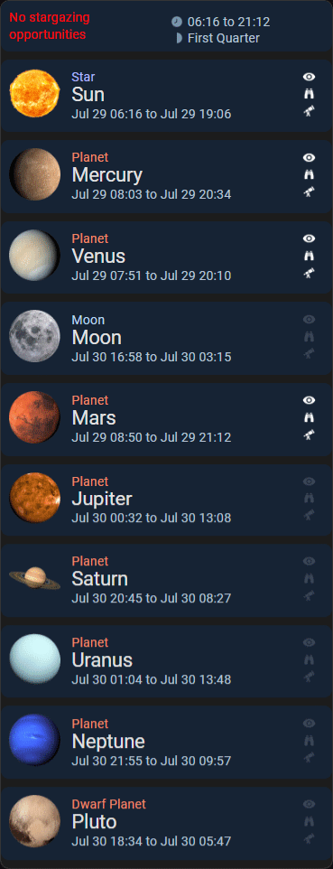

# Sky Tonight Native Card

[](https://github.com/wwwescape/sky-tonight-native-card/releases)
[](https://github.com/wwwescape/sky-tonight-native-card/commits/master)
[](https://github.com/wwwescape/sky-tonight-native-card)
[](https://github.com/hacs/default)
[](https://codecov.io/gh/wwwescape/sky-tonight-native-card/)
[](https://www.codefactor.io/repository/github/wwwescape/sky-tonight-native-card)


#### Get list of visible planetary bodies in your sky.



## Installation


### Manual install
1. Navigate to your `<config>/www/` folder inside your Home Assistant installation and create a new folder named `sky-tonight-native-card`.
2. Manually download [sky-tonight-native-card.js](https://raw.githubusercontent.com/wwwescape/sky-tonight-native-card/main/sky-tonight-native-card.js) and `images` folder.
3. Place them inside the `sky-tonight-native-card` folder you created in step 1.
4. Add the following to your `configuration.yaml` file:
  ```yaml
  lovelace:
    resources:
      - url: /local/sky-tonight-native-card/sky-tonight-native-card.js
        type: module
  ```
4. Alternately, go to `Settings` -> `Dashboards`. Then in the top right corner, click the 3 dots icon and click `Resources`. Click the `+ Add Resource` button in the bottom right corner. Add `/local/sky-tonight-native-card/sky-tonight-native-card.js` as the `URL` and choose `JavaScript Module` as the `Resource Type`. Click `Create`.
5. Finally, refresh your browser window.

## Configuration

| Name              | Type          | Default                               | Description                                                                                                                     |
| ----------------- | ------------- | ------------------------------------- | ------------------------------------------------------------------------------------------------------------------------------- |
| type              | string        | **Required**                          | `custom:sky-tonight-native-card`                                                                                                |
| title             | string        |                                       | Title of the card (hidden when null or empty)                                                                                   |
| latitude          | string        | **Required**                          | Latitude of the observer                                                                                                        |
| longitude         | string        | **Required**                          | Longitude of the observer                                                                                                       |
| elevation         | number        |                                       | Elevation of the observer in metres above sea level                                                                             |
| time              | string        |                                       | Time of observation in [ISO 8601](https://en.wikipedia.org/wiki/ISO_8601) format, defaults to current time                      |
| showSun           | boolean       | `true`                                | Set to false to hide the Sun                                                                                                    |
| onlyAboveHorizon  | boolean       | `true`                                | Set to false to display all planetary bodies even if they are below the horizon                                                 |
| weatherEntity     | string        |                                       | If a weather entity is provided, appropriate stargazing suggestions will be shown based on the weather                          |
| translations      | dictionary    |  _[translations](#Translations)_      | Dictionary to override the default translation                                                                                  |

## Example configurations

```yaml
type: custom:sky-tonight-native-card
latitude: 28.627222
longitude: -80.620833
```

## Translations

The following texts can be translated or altered.

| Key                         | Default value               |
| --------------------------- | --------------------------- |
| jan                         | Jan                         | 
| feb                         | Feb                         | 
| mar                         | Mar                         | 
| apr                         | Apr                         | 
| may                         | May                         | 
| jun                         | Jun                         | 
| jul                         | Jul                         | 
| aug                         | Aug                         | 
| sep                         | Sep                         | 
| oct                         | Oct                         | 
| nov                         | Nov                         | 
| dec                         | Dec                         | 
| above-horizon               | Above Horizon               | 
| below-horizon               | Below Horizon               | 
| sun                         | Sun                         | 
| mercury                     | Mercury                     | 
| venus                       | Venus                       | 
| moon                        | Moon                        | 
| mars                        | Mars                        | 
| jupiter                     | Jupiter                     | 
| saturn                      | Saturn                      | 
| uranus                      | Uranus                      | 
| neptune                     | Neptune                     | 
| pluto                       | Pluto                       | 
| star                        | Star                        | 
| planet                      | Planet                      | 
| dwarf-planet                | Dwarf Planet                | 
| visible-to-the-naked-eye    | Visible to the naked eye    | 
| visible-with-binoculars     | Visible with binoculars     | 
| visible-with-telescope      | Visible with telescope      | 
| nothing-to-see              | Nothing to see              | 
| no-stargazing-opportunities | No stargazing opportunities | 
| enjoy-your-stargazing       | Enjoy your stargazing       | 
| first-quarter               | First Quarter               | 
| full                        | Full Moon                   | 
| last-quarter                | Last Quarter                | 
| new                         | New Moon                    | 
| waning-cresent              | Waning Cresent              | 
| waning-gibbous              | Waning Gibbous              | 
| waxing-cresent              | Waxing Cresent              | 
| waxing-gibbous              | Waxing Gibbous              | 

Example:

```yaml
type: custom:sky-tonight-native-card
latitude: 28.627222
longitude: -80.620833
time: 2023-07-01T00:00:00Z
translations: 
  'jan' : 'January' 
```


## TODO
- [ ] Add tests
- [ ] Redesign and optimize the layout for all screen resolutions
- [ ] Use the weather entity in a better way
- [ ] Use Sun and Moon entity